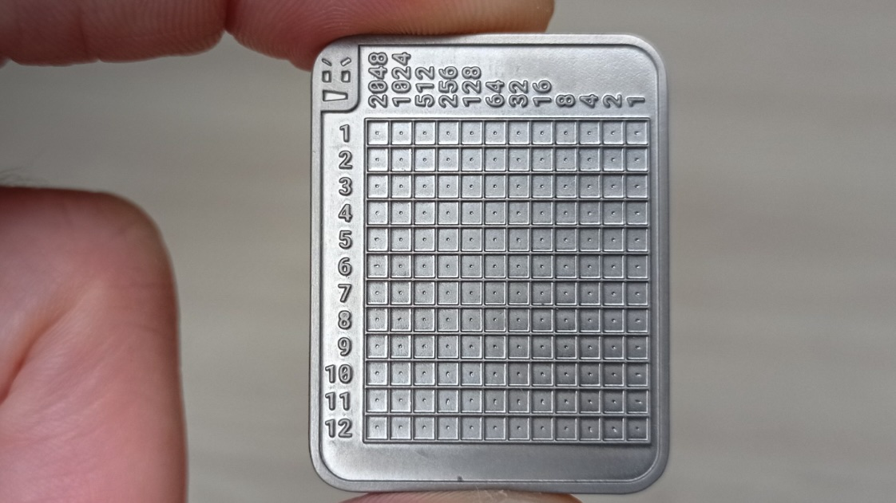
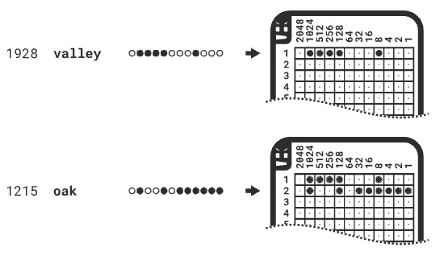
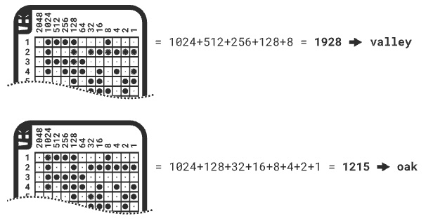

# Stored Cold Seed - TDD Kata

<p align="center">
  
</p>


## Context

A backup Bitcoin seed wallet, often referred to as a seed phrase or mnemonic phrase, is a crucial component of cryptocurrency wallets, particularly those that follow the Hierarchical Deterministic (HD) wallet standard, such as BIP-39 ([Bitcoin Improvement Proposal 39](https://github.com/bitcoin/bips/blob/master/bip-0039.mediawiki)). This seed phrase is a sequence of [words](https://github.com/bitcoin/bips/blob/master/bip-0039/english.txt) (usually 12, 18, or 24 words) that serves as a backup and recovery mechanism for your cryptocurrency wallet.

When you create a new wallet, you are provided with a seed phrase. Losing access to the seed phrase can result in permanent loss of funds, as it's the only means of recovering your wallet and associated private keys.

## Milestone 1: Encrypt

<p align="center">
  
</p>

We want to find the position of the word in the [word list](https://github.com/bitcoin/bips/blob/master/bip-0039/english.txt) in binary.

### 1st iteration

Create a function that given a word from the [word list](https://github.com/bitcoin/bips/blob/master/bip-0039/english.txt), it will give you the position in the list in binary (as `string`).

```php
# Proposal code to start...
final class StoredColdSeed 
{
  public function getBinaryPosition(string $word): string
  {
    // ...
  }
}
```

Eg:
```php 
getBinaryPosition("abandon") == "000000000001"
getBinaryPosition("ability") == "000000000010"
getBinaryPosition("able")    == "000000000011"
...
getBinaryPosition("enroll")  == "001001011010"
getBinaryPosition("lunar")   == "010000101001"
```

### 2nd iteration

Allow receiving an array of words, and the result will be a `string` with the binary positions separated by one space.

Eg:
```php
getBinaryPositions(["enroll", "lunar"]) == "001001011010 010000101001"
```

---

## Milestone 2: Decrypt

<p align="center">
  
</p>

We want to get the word (based on the [word list](https://github.com/bitcoin/bips/blob/master/bip-0039/english.txt)) knowing its binary position in the list:

### 1st iteration

Create a function that given a binary number (as `string`), the result will be the word associated to that position.

```php
# Proposal code to start...
final class StoredColdSeed 
{
  public function readWord(string $binary): string
  {
    // ...
  }
}
```

Eg:
```php 
readWord("000000000001") == "abandon"
readWord("000000000010") == "ability"
readWord("000000000011") == "able"
...
readWord("001001011010") == "enroll"
readWord("010000101001") == "lunar"
```

### 2nd iteration

Allow receiving an array of binary numbers, and the result will be a single `string` with those words separated by one space.

```php
# example
readWords(["001001011010", "010000101001"]) == "enroll lunar"
```

### 3rd iteration

Instead of passing the binary number as `string`, allow passing it as `integer` in the same function.

```php 
readWord("000000000001") == readWord(0b000000000001) == "abandon"
readWord("000000000010") == readWord(0b000000000010) == "ability"
```

---

PRs and other ideas and contributions are welcome!

> This is an original kata, idea inspired by [tinyseed](https://tinyseed.io).
